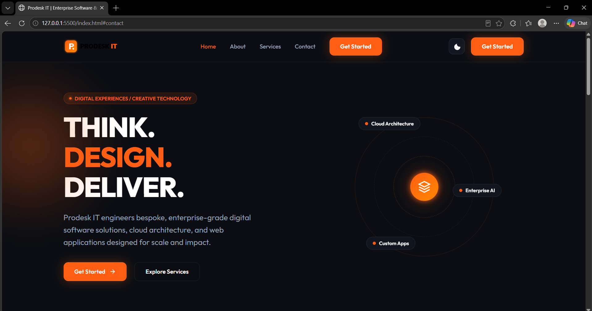

# Prodesk IT — Enterprise Digital Landing Page

A production-quality, responsive landing page for **Prodesk IT** built strictly with pure HTML5, CSS3 custom properties, and Vanilla JavaScript. Designed around the agency concept **"THINK. DESIGN. DELIVER."**, featuring a dark charcoal aesthetic with warm glowing orange accents and pure CSS orbital visual art.

---

## 🚀 Live Demo & Repository

- **Live Deployment URL**: `https://vinayak2922k.github.io/Prodesk-IT-Landing-Page/`
- **GitHub Repository**: `https://github.com/vinayak2922k/Prodesk-IT-Landing-Page`

---

## 📸 Preview



---

## ✨ Features

- **Futuristic Hero Visual**: Built purely with CSS concentric rotating rings, floating nodes, and subtle orange ambient glow (no WebGL or external 3D libraries).
- **Responsive Architecture**: Mobile-first responsive layout tested across 320px, 375px, 425px, 768px, 1024px, 1280px, and 1440px viewport widths.
- **Phase 2 Enhancements**:
  - **Dark / Light Mode Toggle**: Smooth theme switching using CSS custom properties with local storage persistence.
  - **Sticky Backdrop Header**: Frosted-glass navigation header (`backdrop-filter: blur(12px)`).
  - **Responsive Hamburger Navigation**: Mobile navigation drawer with body scroll lock.
  - **Card Hover Elevation**: Smooth scale and shadow elevation on service cards.
  - **Smooth ScrollSpy**: Active link highlights based on window scroll position.

---

## 🛠️ Technology Stack

- **Structure**: HTML5 (Semantic elements, ARIA attributes for accessibility)
- **Styling**: Pure CSS3 (CSS Grid, Flexbox, Custom Properties, Media Queries, CSS Keyframes)
- **Scripting**: Vanilla JavaScript (ES6+, DOM Manipulation, LocalStorage)
- **Typography**: Google Font ('Outfit', sans-serif)

*Strictly zero external dependencies, frameworks, or CSS libraries (No Bootstrap, Tailwind, React, jQuery, or Three.js).*

---

## 📂 Project Folder Structure

```
Prodesk-IT-Landing-Page/
│
├── index.html                # Semantic HTML5 Landing Page
│
├── assets/
│   ├── images/              # Project screenshots and images
│   ├── icons/               # SVG icons
│   └── logo/                # Vector brand logo
│
├── css/
│   ├── style.css            # CSS variables, resets, design tokens & layout
│   ├── responsive.css       # Media queries (320px to 1440px)
│   └── animations.css       # CSS keyframes for orbital visual & micro-interactions
│
├── js/
│   └── script.js            # Theme toggle, mobile menu, scrollspy & dynamic year
│
├── README.md                # Project documentation
├── Prompts.md               # Prompt engineering log
└── .gitignore               # Excluded git tracking files
```

---

## 💻 How to Run Locally

Since this project uses pure static web technologies, no build tools or package managers (`npm`/`yarn`) are required.

### Method 1: Direct File Opening
1. Clone or download the repository.
2. Double-click `index.html` to open it directly in any modern web browser.

### Method 2: Local Web Server (Recommended)
Using Python's built-in HTTP server or VS Code Live Server:

```bash
# Using Python 3 in project directory
python -m http.server 8000
```
Then open `http://localhost:8000` in your web browser.

---

## 📋 Verified Corporate Information

- **Company Name**: Prodesk IT
- **Established**: 2012 (Founded by Dr. Amit Maheshwari)
- **Corporate Office**: Kodihalli, Bengaluru, Karnataka, India
- **Development Center**: Sector 2, Noida, Uttar Pradesh, India
- **Official Domain**: [https://prodesk.in/](https://prodesk.in/)
